# Laporan Proyek 2 Machine Learning Terapan

Nama : Bryant Steven Aritonang
ID Dicoding : bryantarios

    

## Project Overview

Dalam era digital yang serba canggih ini, akses terhadap informasi menjadi lebih mudah dan tak terbatas. Informasi telah menjadi kebutuhan utama dalam dunia bisnis yang terus berkembang. Terdapat tren peningkatan ketergantungan pada eksplorasi data guna menghasilkan solusi bisnis. Perusahaan-perusahaan berusaha memahami preferensi pelanggan dengan menggali informasi dari data, mendorong munculnya sistem rekomendasi. Sistem ini memainkan peran krusial dalam berbagai bidang, menjadi kekuatan yang dahsyat. Banyak perusahaan mengadopsi sistem rekomendasi untuk meningkatkan pengalaman pengguna dan mencapai pertumbuhan pelanggan. Sistem ini bekerja dengan memprediksi preferensi pengguna berdasarkan perilaku masa lalu, memberikan saran sesuai preferensi ini untuk masa mendatang. Aplikasi sistem rekomendasi meluas, mencakup rekomendasi film, konten video di YouTube, hingga rekomendasi musik di Spotify.

Di sisi lain, pandemi COVID-19 telah mempercepat pertumbuhan konten digital, terutama peningkatan penawaran TV series dan film yang dinikmati oleh masyarakat global, termasuk di Tanah Air. Berkembangnya layanan streaming seperti Netflix, Disney Plus, dan lainnya menciptakan tren baru dalam kegiatan menonton film, seperti binge-watching dan hopping, yaitu menonton secara beruntun tanpa jeda. Dengan banyaknya konten dan genre film yang tersedia, platform streaming perlu menyediakan konten yang relevan dengan minat pelanggan. Sistem rekomendasi menjadi solusi efektif untuk memberikan rekomendasi film yang sesuai dengan preferensi pengguna. Oleh karena itu, proyek machine learning ini bertujuan untuk mengembangkan model machine learning dalam sistem rekomendasi film, dengan mempertimbangkan rating film dari masa lalu pengguna untuk memberikan rekomendasi yang akurat dan sesuai dengan preferensi masing-masing pengguna.

## Business Understanding

### Problem Statements

Berdasarkan konteks yang telah dijelaskan sebelumnya, perumusan masalah dapat disusun lebih efektif sebagai berikut:

- Bagaimana merancang dan membangun sistem rekomendasi film yang optimal, dapat memahami serta merespons secara akurat terhadap preferensi, minat, dan perilaku pengguna?
- Bagaimana mengukur dan mengevaluasi kinerja model dalam pengembangan sistem rekomendasi film, sehingga dapat memastikan keberhasilan dalam mencocokkan rekomendasi dengan preferensi, minat, atau perilaku pengguna secara efektif?

### Goals

Berdasarkan perumusan masalah sebelumnya, proyek penelitian ini bertujuan:

- Mengembangkan metode pengembangan sistem rekomendasi film yang optimal, dapat secara akurat memahami serta merespons preferensi, minat, dan perilaku pengguna.
- Mengevaluasi hasil dan kinerja model dalam pengembangan sistem rekomendasi film, dengan fokus memastikan kesesuaian rekomendasi dengan preferensi, minat, atau perilaku pengguna secara efektif.

### Solution statements

Berdasarkan tujuan yang telah dipaparkan diatas, maka proyek penelitian ini memiliki solusi atau tahapan sebagai berikut:

- Melakukan pre-processing data dan analisis eksploratif data (EDA) pada dataset yang digunakan, dengan fokus pada hubungan antar fitur untuk mendapatkan wawasan dan pengetahuan yang mendalam.
- Mengembangkan model machine learning yang tepat untuk membangun sistem rekomendasi, dan mengevaluasi kinerja model menggunakan matriks evaluasi. Teknik implementasi mencakup:
  - Content-Based Filtering, yang merekomendasikan item berdasarkan kemiripan dengan item yang dipilih.
  - Collaborative Filtering, sebagai sistem rekomendasi berdasarkan preferensi komunitas atau pengguna lain.
- Menampilkan hasil rekomendasi yang dihasilkan oleh model yang telah dikembangkan.
- Melakukan evaluasi menggunakan metrik evaluasi untuk menilai kualitas dan efektivitas sistem rekomendasi yang telah dibangun.

## Data Understanding

Dataset yang digunakan dalam proyek ini berasal dari MovieLens dan dikenal sebagai [MovieLens 25M Dataset](https://grouplens.org/datasets/movielens/#:~:text=MovieLens%2025M%20Dataset).Dataset ini disajikan dalam format zip dan terdiri dari tujuh file terpisah, yakni movies.csv, ratings.csv, genome-scores.csv, links.csv, tags.csv, genome-tags.csv, dan README.txt. Menurut informasi yang terdapat dalam README.txt, dataset ml-25m mengandung data film beserta peringkat yang diberikan oleh pengguna. Jumlah peringkat film dalam dataset mencapai 25.000.095, dikumpulkan dari partisipasi 162.541 pengguna. Data ini melibatkan rentang waktu rilis film mulai dari 09 Januari 1995 hingga 21 November 2019. Dataset ini pertama kali dibuat pada 21 November 2019.

    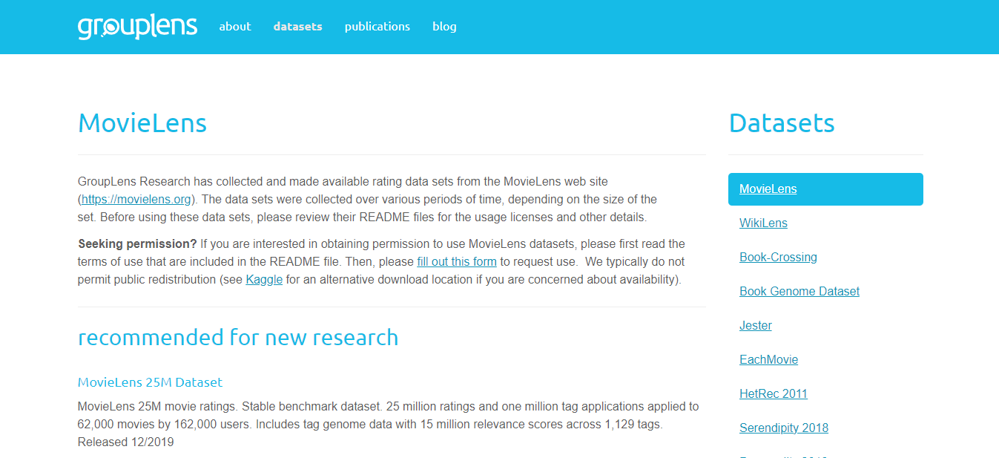

### Variabel-variabel pada dataset:

Pada file `movies.csv` berisi daftar film yang memiliki 62.423 records data dan 3 feature:

- `movieId` : memuat nomor ID film
- `title` : memuat judul film
- `genres` : memuat genre film

Pada file `ratings.csv` berisi daftar ratings atau penilaian terhadap satu film yang memiliki 25.000.095 records data dan 4 feature:

- `userId` : memuat nomor ID users
- `movieId` : memuat nomor ID film
- `rating` : memuat rating atau penilaian films dalam skala bintang, dengan peningkatan setengah bintang dalam rentang 0,5 - 5 bintang
- `timestamp` : memuat kode timestamp

Pada file `tags.csv` berisi daftar tags pada film yang diberikan users yang memiliki 1.093.360 records data dan 4 feature:

- `userId` : memuat nomor ID users
- `movieId` : memuat nomor ID film
- `tag` : memuat tag film
- `timestamp` : memuat kode timestamp

Pada file `links.csv` berisi daftar links film yang mengarah ke laman website films memiliki 62.423 records data dan 3 feature:

- `movieId` : memuat nomor ID film yang merujuk pada website MovieLens
- `imdbId` : memuat nomor ID film yang merujuk pada website IMDb
- `tmdbId` : memuat nomor ID film yang merujuk pada website TMDB

Pada file `genome_tags.csv` berisi daftar deskripsi tags yang mereference ke `tagId` yang memiliki 1.128 records data dan 2 feature:

- `tagId` : memuat nomor ID tags
- `tag` : memuat deskripsi tag

Pada file `genome_scores.csv` berisi daftar deskripsi tags yang mereference ke `tagId` yang memiliki 15.584.448 records data dan 3 feature:

- `movieId` : memuat nomor ID film
- `tagId` : memuat nomor ID tags
- `relevance` : memuat skor relevansi

### Exploratory Data Analysis (EDA)

Proses EDA dilaksanakan dengan menganalisis dataset untuk mendapatkan pemahaman menyeluruh tentang dataset, sehingga dapat mengungkap insight dan pengetahuan yang berharga.

**Univariate Analysis**

Dengan merujuk pada informasi sebelumnya, ada enam file CSV yang ingin saya pisahkan menjadi tiga kelompok data berdasarkan kategori ID, yakni data film, pengguna, dan skor relevansi film. Setelah itu, saya akan mengevaluasi jumlah data masing-masing kategori.

- tag relevance scores

  

      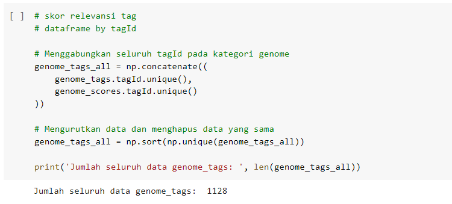
  

- films

  

      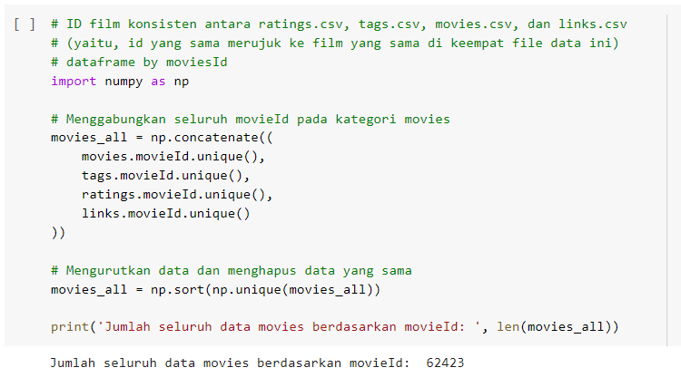
  

- user ratings

  

      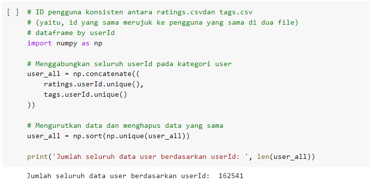
  

Dengan mengacu pada ketiga informasi tersebut, terdapat 1.128 entri unik pada data tag genome, 62.423 entri unik pada data film, dan 162.541 entri unik pada data pengguna. Menurut saya, jumlah data pada skor relevansi berdasarkan tagId terlihat relatif kecil, hanya sekitar 1K, yang berbeda jauh dengan jumlah data pada pengguna dan film masing-masing sekitar 62K dan 162K. Oleh karena itu, saya memutuskan untuk fokus bekerja dengan data film dan pengguna saja.

## Data Preparation

Teknik yang diterapkan dalam Persiapan Data adalah sebagai berikut:

Dari perspektif urutan proses dalam persiapan data, langkah pertama yang saya lakukan adalah membersihkan data pada file movies.csv dan ratings.csv. Setelah keduanya dianggap sudah cukup baik, saya melanjutkan dengan menggabungkan kedua dataframe tersebut dan membentuk dataframe komprehensif sebagai dasar pengembangan sistem rekomendasi. Berikut adalah rinciannya:

1. **Data Cleaning** `movies.csv`

   Di dalam data `movies.csv`, tahun rilis film disertakan bersamaan dengan judul film dalam satu fitur. Oleh karena itu, diperlukan penanganan khusus untuk memisahkan judul film dan tahun rilis agar tidak muncul masalah yang tidak diinginkan saat proses pelatihan model. Dalam konteks ini, setiap tahun rilis film akan diisolasi dan ditempatkan dalam kolom tersendiri.

2. **Data Cleaning** `ratings.csv`

   Dalam data `ratings.csv`, skala rating pada fitur rating menunjukkan sebaran yang tidak normal. Skala rating berkisar antara 0.5 hingga 5 dengan selisih 0.5 pada setiap skala. Untuk menangani hal ini, dilakukan pembulatan nilai skala pada fitur rating agar distribusi skala berada dalam rentang 1 hingga 5. Selain itu, terdapat data dalam bentuk kode timestamp yang sulit dipahami kapan data tersebut diambil secara spesifik. Oleh karena itu, dilakukan proses konversi untuk mengubah timestamp menjadi data datetime.

3. **Data Merging** `movies` dengan `ratings`

   Penggabungan dilaksanakan melalui proses merge antara dataframe `movies` dan `ratings`, membentuk satu dataframe menyeluruh yang kemudian diassign ke dalam variabel `films`.

4. **Data Cleaning** `films`

   Ada beberapa handling yang dilakukan pada dataframe `films`, diantaranya sebagai berikut.

   - Handling Missing Values

     Data yang hilang, null, NaN, atau tidak terbaca seringkali merupakan masalah umum. Untuk memastikan kinerja model yang dikembangkan tidak terpengaruh oleh data yang hilang, saya memutuskan untuk menghapusnya. Dalam proyek ini, saya menemukan nilai yang hilang pada beberapa fitur, termasuk genre, di mana terdapat data '(no genres listed)'.

   - Data Reduction

     Jumlah data yang terlalu besar dapat memperlambat proses machine learning. Saya mengasumsikan bahwa beberapa film mungkin mendapatkan sedikit ulasan dari pengguna. Dengan mengetahui bahwa nilai rating berkisar antara 1 hingga 5, saya memutuskan untuk menghapus film yang mendapatkan penilaian kurang dari 50 ulasan (jumlah rating 50-250), atau setidaknya memiliki rating kurang dari 50. Saya percaya bahwa ini tidak akan menjadi masalah, mengingat jumlah data dalam dataset sudah cukup besar, dan proses pengurangan dapat meningkatkan runtime model sambil menghemat memori.

   - Handling Duplicate Data

     Dataset yang berantakan dan memiliki duplikat dapat memengaruhi hasil pemodelan dan analisis akhir. Dalam proyek ini, terdapat banyak duplikasi data berdasarkan id film dan judul film. Menghapusnya adalah langkah yang tepat untuk menjaga kebersihan data.

   - Fixed data in genre features

     Pada fitur genre, saya menemukan genre Sci-Fi. Setelah saya pahami, ternyata Sci-Fi merupakan singkatan dari kata Science Fiction yang menggambarkan film fiksi ilmiah. Kata Sci-Fi memiliki separator dash atau tanda pisah. Hal ini perlu dihilangkan karena pada tahap vektorisasi TF-IDF, kata Sci-Fi akan dianggap sebagai dua kata terpisah, yaitu Sci dan Fi. Pada tahap TF-IDF, selain vektorisasi, juga dilakukan tokenisasi.

## Modeling

Pada proyek ini, pendekatan yang dipakai untuk mengembangkan model dalam sistem rekomendasi adalah `Content-Based Filtering` dan `Collaborative Filtering`.

- **Content-Based Filtering**

  Pada prinsip dasar content-based filtering, rekomendasi item disusun dengan mempertimbangkan kesamaan antara item yang disukai oleh pengguna, berdasarkan aktivitas pengguna di masa lalu. Sebagai contoh, jika Mawan menyukai film Disney Coco, sistem akan menyarankan film dengan genre animasi yang serupa, seperti Encanto. Secara keseluruhan, semakin banyak informasi yang diperoleh dari aktivitas pengguna, semakin tinggi akurasi sistem rekomendasi yang dihasilkan.

  

      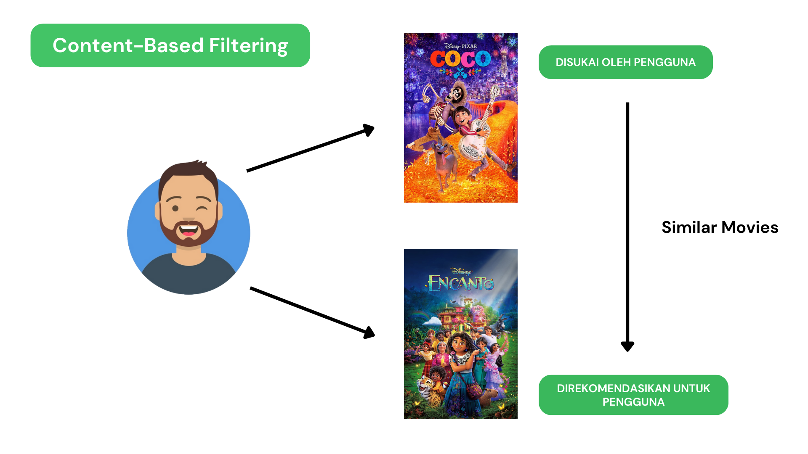
  

  Pada proyek ini, saya akan menerapkan pendekatan content-based filtering untuk mengembangkan model dan membangun sistem rekomendasi film sesuai dengan tujuan proyek. Berikut adalah beberapa tahapan yang saya jalankan.

  1. Prepare data

     Menyiapkan dataframe yang telah dibersihkan dalam tahap data preparation sebelumnya.

  2. TF-IDF Vectorizer

     Dalam proyek ini, diperlukan proses term frequency-inverse document frequency (TF-IDF) untuk menemukan representasi kata yang signifikan dalam kolom genre. Implementasi dari proses vectorizer dilakukan menggunakan fungsi [tfidfvectorizer()](https://scikit-learn.org/stable/modules/generated/sklearn.feature_extraction.text.TfidfVectorizer.html) yang telah disediakan oleh library scikit-learn. Berikut ini adalah hasil dari TF-IDF dalam bentuk matriks, yang menunjukkan korelasi antara film dengan genre-nya.

     

         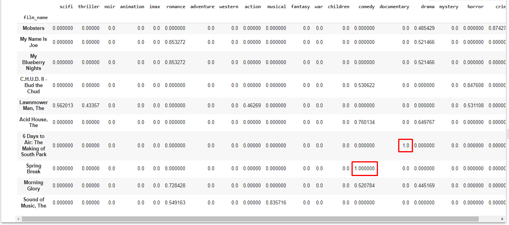
     

  3. Perhitungan Cosine Similarity

     Cosine similarity digunakan untuk mengukur tingkat kesamaan antar film. Dalam proyek ini, perhitungan similarity dijalankan dengan mengimplementasikan fungsi [cosine_similarity()](http://scikit-learn.org/stable/modules/generated/sklearn.metrics.pairwise.cosine_similarity.html) yang tersedia dalam library sklearn. Perhitungan similarity merupakan tahapan kunci dalam pendekatan content-based filtering, karena pada dasarnya pendekatan ini menerapkan prinsip kesamaan antar item untuk menghasilkan rekomendasi yang sesuai. Hasil dari cosine similarity akan membentuk matriks kesamaan yang dapat dilihat setelah dikonversi menjadi dataframe.

     

         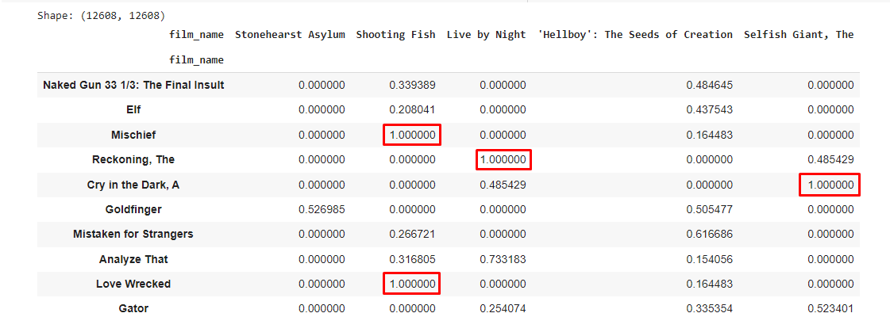
     

  4. Create Custom Functions

     Langkah terakhir melibatkan pembuatan fungsi khusus untuk menghasilkan rekomendasi berdasarkan data input yang diinginkan. Fungsi ini bekerja dengan mengambil similarity dari data film yang dicari, kemudian data yang mirip dimasukkan ke dalam variabel closest. Parameter K didefinisikan untuk menghasilkan top-K rekomendasi berdasarkan tingkat similarity tertinggi. Film yang dicari akan dihapus agar tidak muncul dalam daftar rekomendasi. Pada tahap terakhir, return digunakan untuk mengembalikan nilai dalam bentuk dataframe, dimana nilai yang dikembalikan merupakan rekomendasi judul film berdasarkan tingkat similarity.

     

         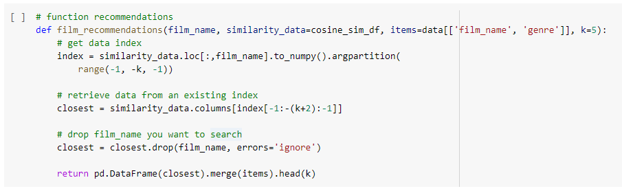
     

  5. Recommendations

     

         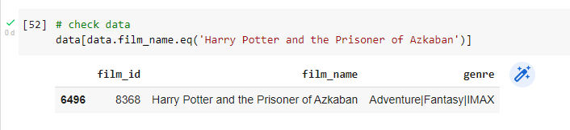
     

     Berikut ini merupakan Top 5 Recommendations berdasarkan genre dari film 'Harry Potter and the Prisioner of Azkaban'. Sistem telah berhasil merekomendasikan film dengan sesuai, bisa dilihat pada hasil yang mendapatkan rekomendasi film yang mirip dengan genre Adventure dan Fantasy.

     

         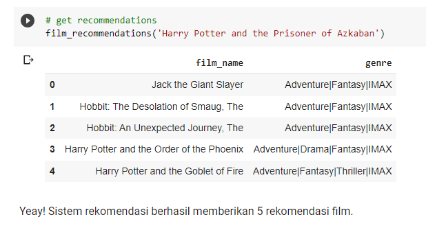
     

  Kelebihan Content-Based Filtering

  - Mampu memberikan penjelasan tentang cara rekomendasi diperoleh.
  - Kemampuan untuk merekomendasikan item baru kepada pengguna, bahkan jika item tersebut belum pernah di-rate oleh siapapun. Hal ini karena prinsip kerjanya melibatkan analisis deskripsi item yang terdapat pada item yang pernah mendapatkan nilai rating tinggi.

  Kekurangan Content-Based Filtering

  - Terbatasnya rekomendasi hanya pada item yang mirip, sehingga tidak memberikan kesempatan untuk mendapatkan item yang tidak terduga (serendipity).

  - Sistem tidak dapat memberikan rekomendasi kepada pengguna baru yang belum pernah melakukan aktivitas atau tidak memiliki profil pengguna yang memadai, yang dikenal sebagai masalah Cold Start.

- **Collaborative Filtering**

  Konsep dasar dari collaborative filtering adalah

  1. Data Understanding

     Tahap awal melibatkan penggunaan beberapa library, termasuk tensorflow, dan menggunakan dataframe 'preparation' yang sebelumnya telah digunakan.

  2. Data Preparation

     Encoding dilakukan pada tahap ini, dengan melakukan encode pada fitur 'userId' dan 'movieId'. Proses encoding akan memetakan setiap nilai pada kedua fitur tersebut ke dalam bentuk indeks.

  3. Split Data for Training and Validation

     Data dibagi menjadi data pelatihan dan validasi dengan rasio 80/20. Pembagian ini bertujuan untuk mengembangkan model dan mengevaluasi performa model yang telah dikembangkan.

  4. Training

     Proses pelatihan dilakukan dengan menerapkan teknik embedding untuk menghitung skor kesesuaian antara film dan pengguna. Pada tahap kompilasi, digunakan BinaryCrossentropy untuk menghitung fungsi kerugian, Adam (Adaptive Moment Estimation) sebagai pengoptimalkan, dan root mean squared error (RMSE) sebagai metrik evaluasi. Pelatihan model dijalankan sebanyak 25 epochs.

  5. Metrics Visualization

     Berdasarkan visualisasi, pada proses training model didapatkan nilai error akhir sebesar sekitar 0.17 dan error pada data validasi sebesar 0.26

     

         
     

  6. Recommendations

     Kemudian menggunakan model.predict(), sistem akan memberikan rekomendasi sebagai berikut.

     

         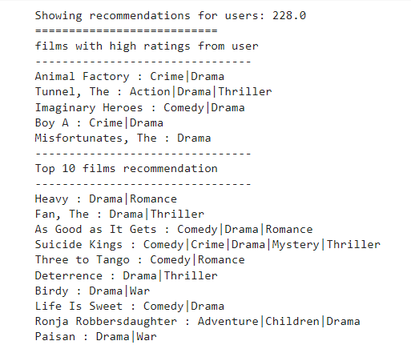
     

  Kelebihan Collaborative Filtering

  - Mampu memberikan rekomendasi berdasarkan preferensi komunitas atau pengguna lain.

  Kekurangan Collaborative Filtering

  - Membutuhkan jumlah pengguna yang banyak.

## Evaluation

Evaluasi digunakan untuk mengukur sejauh mana kinerja model sistem rekomendasi. Dalam proyek ini, evaluasi diukur dengan menggunakan metrik sesuai dengan pendekatan yang digunakan dalam pengembangan sistem rekomendasi.

- **Content-Based Filtering**

  Pada pendekatan Content-Based Filtering, kinerja model diukur dengan menggunakan metrik precisions dengan nilai similarity. Cosine Similarity digunakan sebagai ukuran yang mengkuantifikasi tingkat kesamaan antara dua atau lebih vektor.

  Nilai cosinus similarity memiliki rentang yang terbatas antara 0 dan 1. ukuran kemiripan ditentukan oleh ukuran cosinus sudut antara dua vektor tak nol. Semakin besar nilai cosinus similarity semakin mendekati 1, maka sudut antara kedua vektor juga semakin kecil. Bisa dilihat pada gambar di bawah ini.

  

      
  

  Precision mengukur tingkat ketepatan antara informasi yang diminta oleh pengguna dan hasil yang diberikan oleh sistem. Metrik ini sangat relevan sebagai evaluasi pada sistem rekomendasi, di mana kualitas pengukuran ditentukan oleh seberapa akurat sistem dapat melakukan prediksi.

  

      
  

  Pada pendekatan content-based filtering ini, saya memakai film 'Harry Potter and the Prisioner of Azkaban' untuk mencari rekomendasi film lain yang sesuai. dan mendapatkan hasil sebagai berikut.

  

      
  

  Dengan memakai metrics precision, maka dapat dihitung:

  - 'Harry Potter and the Prisioner of Azkaban' bergenre Adventure, Fantasy, IMAX.
  - Dari 5 film rekomendasi, terdapat 3 film yang memiliki genre yang sama dengan yang dicari yaitu, genre Adventure, Fantasy, IMAX. film terakhir, merekomendasikan film lain dengan genre drama dan thriller. Ini tidak sesuai dengan apa yang dicari.

  Maka, sesuai dengan formula,

  _precision = (# of our recommended that are relevan) / (# of items we recommended item)_

  _precision = 3 / 5_

  _precision = 0.6_

  _precision = 60%_

  Berdasarkan Top 5 rekomendasi film yang diberikan didapatkan pricisions sebesar 60% dari model content-based filtering untuk sistem rekomendasi yang telah dikembangkan.

- **Collaborative Filtering**

  Evaluasi kinerja dari pendekatan Collaborative Filtering menggunakan metode Root Mean Squared Error (RMSE). RMSE merupakan metrik standar yang digunakan untuk mengukur rata-rata kesalahan model dalam melakukan prediksi. Proses RMSE melibatkan pengurangan nilai prediksi dari nilai observasi, hasilnya dikuadratkan, dan kemudian jumlah keseluruhan hasil tersebut dibagi dengan jumlah data (n).

  Saat melakukan training model, RMSE sangat membantu untuk mengevaluasi dari model dengan melihat penurunan kesalahan pada setiap iterasi (epochs). Kemudian, hasil dari proses training model dapat divisualiasasikan ke dalam plot metrics sebagai berikut.

  

      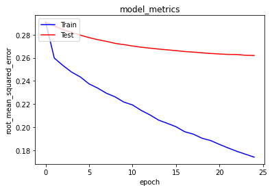
  

  Berdasarkan plot metriks di atas, nilai RMSE didapatkan sebesar 0.17 dan pada data validasi sebesar 0.26 yang mana sistem yang telah dikembangkan sudah cukup baik.

## Conclusion

Dalam penelitian ini, telah berhasil dikembangkan model sistem rekomendasi untuk film dengan mengimplementasikan dua teknik berbeda, yaitu Content-Based Filtering dan Collaborative Filtering. Hasil rekomendasi yang diperoleh menunjukkan tingkat kualitas yang memuaskan. Collaborative Filtering mampu memberikan rekomendasi yang sesuai, sementara Content-Based Filtering dapat menyarankan film yang serupa berdasarkan kesamaan genre. Namun, perlu diperhatikan bahwa dataset yang digunakan memiliki keterbatasan dalam jumlah data film. Oleh karena itu, pada situasi dunia nyata, model ini mungkin tidak selalu memberikan rekomendasi yang sesuai dengan preferensi pengguna, terutama bagi mereka yang lebih tertarik pada film-film terbaru. Model ini dapat cenderung merekomendasikan film-film lama, sehingga perlu dilakukan penyesuaian lebih lanjut untuk meningkatkan ketepatan rekomendasi, terutama dengan mempertimbangkan preferensi pengguna terhadap film-film terkini.

--end of code--
